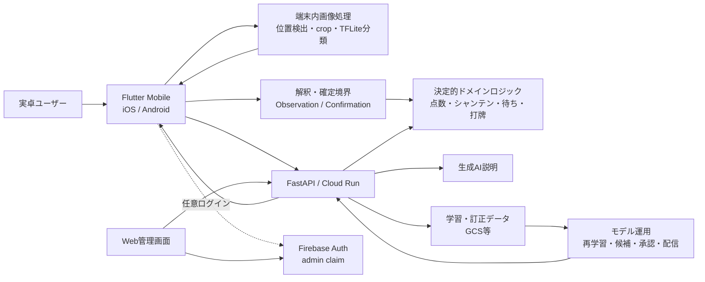
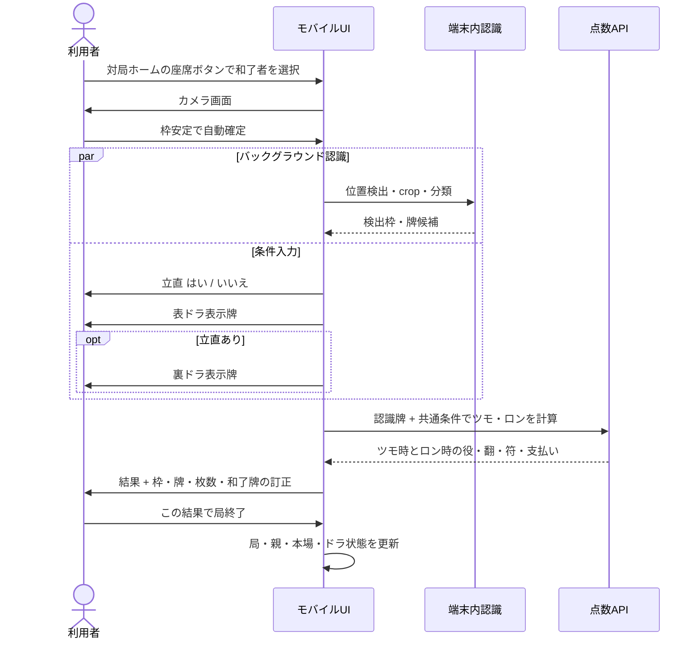
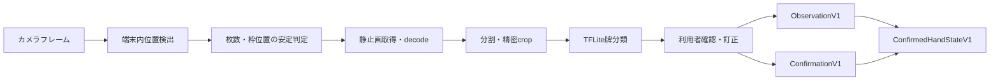
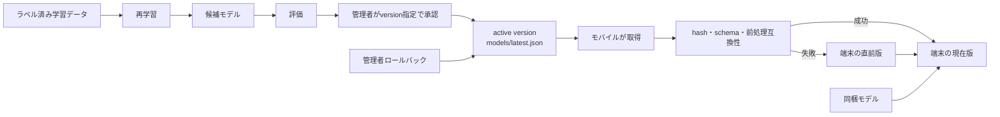
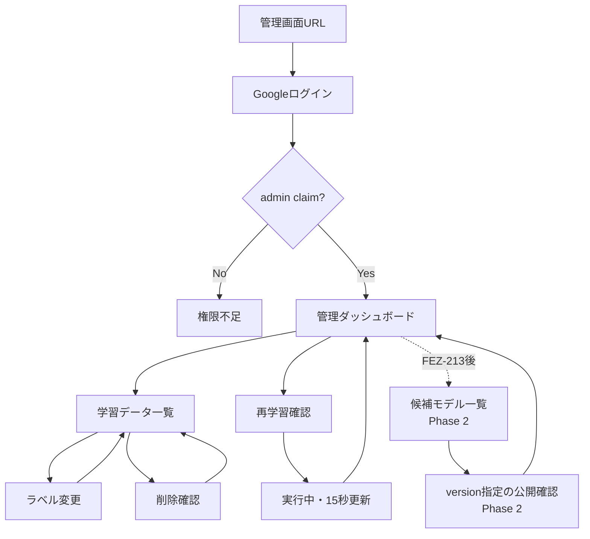
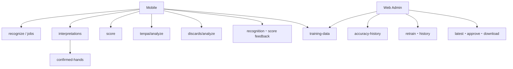
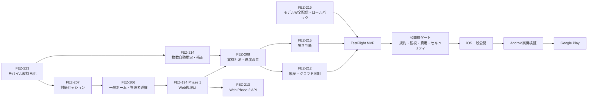

# TsumoAI 全体設計書

- 更新日: 2026-09-22
- 対象: モバイルアプリ、Web管理画面、バックエンド、認識・学習モデル運用
- 状態: 合意済み仕様を統合した実装設計。未決事項と将来範囲は明示する
- 正本の扱い: タスクの状態・優先度はLinear、本書は製品・画面・システム設計の俯瞰資料

## 1. この文書の目的

TsumoAIの製品方針、モバイル画面、Web管理画面、認識処理、バックエンド境界を一つの資料で確認できるようにする。個別Issueの詳細を置き換えるものではなく、実装者が「どの画面からどこへ進み、どの状態とAPIを使うか」を理解する入口とする。

### 状態の凡例

| 表記 | 意味 |
|---|---|
| 現行 | 現在のコードに存在する |
| 設計完了 | 実装へ着手できる粒度で合意済み |
| 要詳細設計 | 要件は決まっているが、保存方式やAPI契約等が未確定 |
| 対象外 | 現時点では実装予定に含めず、具体的な需要が確認できた場合だけ再検討する |

## 2. 製品の定義

### 2.1 対象利用者

実卓で麻雀へ参加できる程度にルールを理解している一方、待ち牌、打牌、鳴き、点数計算に自信がない初心者から中級者を中心とする。

中心となる課題は「この手が何翻・何符で何点か」「何待ちか」「何を切るべきか」を、詳しい人や雀荘店員へ毎回聞かずに確認することである。

### 2.2 製品の位置づけ

TsumoAIは単独のカメラ点数計算機ではなく、実卓の牌を共通の撮影・訂正フローで読み取り、点数、待ち、打牌、鳴き判断、根拠付きAI解説へ接続する実卓麻雀アシスタントとする。

点数、シャンテン、待ち、受け入れ枚数などの事実は決定的ロジックで計算する。生成AIは確定済みの牌と計算結果を根拠に説明し、計算結果そのものを推測しない。

### 2.3 主動線

1. **すぐ確認**: 一般ホームでは局管理なしで、対局ホームでは現在の局状態を引き継いで、点数計算・待ち確認・AI相談の目的を先に選ぶ。共通の撮影・認識・訂正を使い、AI相談は「何を切るべきか」「鳴くべきか」を扱う。
2. **対局セッション**: 1台を卓内で共有し、起家基準の物理席、場、局、親を管理する。

### 2.4 初回範囲

| 段階 | 含める機能 |
|---|---|
| TestFlight MVP | 縦持ちだけで完結するモバイルUI、撮影、位置検出、牌識別、枠・牌訂正、13〜18枚の自動推定・手動補正、最大18物理牌、点数、待ち、打牌、鳴き判断、利用履歴、アカウント紐付き履歴同期、根拠付きAIチャット、すぐ確認、対局セッション、ログイン不要の主要機能 |
| 一般公開前 | 規約・監視・費用上限・セキュリティ・ストア準備 |
| 現時点の対象外 | 卓全体の点棒管理、既存写真・オンライン麻雀のスクリーンショット解析。一般公開後も実装前提にせず、具体的な需要が確認できた場合だけ再検討 |
| 並行対応 | Androidの開発環境・実機不要実装。実機カメラ検証後にGoogle Play公開 |

本場と供託は初回の入力・計算責務から外す。表示の中心は役、翻、符、ロン点またはツモ支払いとする。

## 3. システム全体像



### 3.1 責務境界

| 層 | 責務 | 担当しないこと |
|---|---|---|
| 端末内画像処理 | 牌位置、crop、牌候補、confidence、モデルversion/source | 点数の推測、曖昧な事実の自動確定 |
| 解釈層 | 鳴き候補、和了牌候補、根拠、確信度 | 未確認情報を確定済みに昇格させること |
| 確定境界 | ユーザー訂正を含むConfirmedHandState生成 | 画像再解析 |
| ドメイン層 | 役・符・ドラ・支払い、シャンテン、待ち、打牌 | 画像、座標、ネットワーク、永続化 |
| 生成AI | 決定的結果の初心者向け説明、質問応答 | 点数・待ち・受け入れ枚数の独自推測 |
| 管理画面 | データ、精度、再学習、モデル状態の運用 | 一般ユーザー向け機能 |

## 4. モバイル画面設計

### 4.1 全体ナビゲーション — ユースケース別draw.io

画面一覧を1本のフローへ詰め込まず、利用者がアプリを開いた目的ごとに導線を分ける。意味と遷移条件の正本は [TsumoAI モバイルナビゲーション仕様](./tsumoai-mobile-navigation-spec.md) とし、[TsumoAI モバイルナビゲーション（draw.io）](./tsumoai-mobile-navigation.drawio) はその編集可能な視覚表現とする。仕様を先に更新し、その内容から図を更新する。

| draw.ioページ | 利用者の目的 | 起点と到達点 |
|---|---|---|
| `01_利用目的から見る全体導線` | アプリ全体から目的を選ぶ | 一般ホーム → すぐ確認／対局／履歴／設定 |
| `02_すぐ確認の共通撮影と目的別結果` | 点数・待ち・AI相談をすぐ確認する | 目的選択 → 共通撮影・訂正 → 目的別結果 |
| `03_対局セッション_和了した1局` | 1台を共有して局を進める | 対局ホーム → 和了者 → 認識と条件入力 → 両結果 → 局更新 |
| `04_対局ホームの補助操作` | 流局・単発確認・巻き戻し・終了を行う | 対局ホーム → 補助操作 → 対局ホームまたは終了 |
| `05_履歴ログイン設定と管理導線` | 履歴・アカウント同期・学習協力・運用管理 | ホーム／設定 → 任意ログイン → 各機能 |

一般ホームでは利用目的を最初に確定する。単発確認は選んだ目的の結果へ直接進む。一般ホーム起点では局状態を持たず、対局ホーム起点では現在の場・局・親・本場・登録済みの表ドラを読み取り専用で引き継ぐ。手牌、対象席、立直、裏ドラ、認識訂正は確認ごとに扱う。ログイン中は履歴をアカウントへ自動同期し、学習データ送信時は未ログインの場合だけログインを求める。管理機能はadmin claimで分岐する。

各画面の具体的な情報配置と操作位置は [TsumoAI 画面レイアウト図仕様](./tsumoai-screen-layout-spec.md) と [TsumoAI 画面レイアウト（draw.io）](./tsumoai-screen-layout.drawio) を正本とする。ナビゲーション図は画面間の流れ、画面レイアウト図は1画面内の配置を扱う。

### 4.2 共通レイアウト原則

- 主要タップ領域は48dp以上。
- 撮影、認識、訂正、条件入力の途中には広告を表示しない。
- 起動直後や撮影前にログインを要求しない。
- 1画面1判断を基本とし、選択と同時に次へ進める項目には共通の確定ボタンを置かない。
- 認識結果は確定前に必ず利用者が確認・訂正できる。
- エラー時は入力済み情報を保持して再試行できる。
- 本書のワイヤーフレームは縦持ちの情報階層を示す。色、余白、コンポーネント寸法はモバイルUI実装と実機検証で確定する。

### 4.2.1 画面向き — 縦持ちで確定・FEZ-223

一般利用者向けモバイルフローは`portraitUp`で固定し、起動、ホーム、目的選択、カメラ、自動スキャン、手動トリミング、枠・牌・枚数訂正、条件入力、結果、対局ホーム、履歴、ログイン、設定まで縦画面だけで完了させる。途中で横向きへの切替や端末の持ち替えを要求しない。

カメラセンサーの画像回転と画面向きは分離し、保存画像、検出座標、プレビュー枠を同じ座標系へ変換する。13〜18枚の横一列は縦画面幅へ無理に縮小せず、カメラでは横長の撮影ガイドを縦プレビュー内へ配置し、結果画面では牌が読める大きさを保って横スクロールまたは適切に折り返す。主要操作は下部へ置き、SafeArea、キーボード、広告で隠さない。

### 4.3 一般ホーム — 設計更新

```text
┌─────────────────────────────────┐
│ TsumoAI                         │
│ 実卓の点数・待ちを牌から確認     │
│                                 │
│ すぐ確認                        │
│ [点数計算] [待ち確認]            │
│ [AI相談：何を切る？ 鳴くべき？]  │
│                                 │
│ [対局を始める]       [履歴]      │
│                                 │
│ user@example.com   [ログアウト]  │
│ 未ログイン時:       [ログイン]    │
│                                 │
│ [学習データ作成] ※表示ON時のみ   │
│ 使い方              設定・規約   │
│ [広告: 無料利用時のみ・下部]     │
└─────────────────────────────────┘
```

ログインは主要機能の前提にしない。ホームには未ログイン時のログインボタン、ログイン時のメールアドレスとログアウトボタンを表示する。学習データ作成は設定の「学習データ作成ボタンを表示」がONの場合だけ表示し、送信時にログインを要求する。モデルversion、source、前処理versionは一般画面に表示しない。

### 4.4 カメラ・枚数自動推定 — 設計更新・FEZ-214

```text
┌──────────────────────────────────────┐
│ 戻る                    検出 14枚      │
│ 枚数 [自動][13][14][15][16][17][18]  │
│ ┌──────────────────────────────────┐ │
│ │       カメラプレビュー            │ │
│ │   [検出枠][検出枠] ...            │ │
│ └──────────────────────────────────┘ │
│ 枠が安定したら自動で読み取ります     │
│ [手動撮影]                 [取消]     │
└──────────────────────────────────────┘
```

専用の枚数選択画面やドロップダウンは設けない。初期値はホームで選んだ目的から決定し、点数計算・AI相談の「何を切る」は14枚、待ち確認・鳴き判断は13枚とする。カメラ画面には「自動・13・14・15・16・17・18」の選択肢を常時表示し、どれも1タップで切り替える。「自動」を選んだ場合は13〜18枚の安定した検出数を採用する。横幅が足りない端末では横スクロールできるチップ列とし、「その他」や展開操作を挟まない。枚数と枠位置が安定した時点で自動確定し、手動撮影は復旧手段として残す。14枚を指定した場合は既存の14枚検出経路・パラメータを維持する。

### 4.5 結果画面での認識確認・訂正 — 設計更新

```text
┌──────────────────────────────────────┐
│ 点数計算結果                         │
│ 検出:14枚 [自動][13][14][15][16] → │
│                [17][18] [切り抜く]  │
│ 写真 + 検出枠                        │
│ [一萬][二萬][三萬] ... [東][東]      │
│ [枠を追加] [枠を削除] [撮り直す]     │
│ ──────────────────────────────────── │
│ ツモの場合: 役 / 翻 / 符 / 支払い   │
│ ロンの場合: 役 / 翻 / 符 / 支払い   │
│ [条件を直す] [別の確認へ]            │
└──────────────────────────────────────┘
```

位置検出と牌識別はバックグラウンドで実行し、単発確認では目的別結果へ、対局では条件入力完了後の結果へ進む。枠、牌、検出枚数、和了牌の確認・訂正は結果画面へまとめる。枚数を変更した場合は同じ画像から位置検出と牌識別を再実行する。

手動トリミング機能は実装済みであり、結果画面の「範囲を切り抜く」から利用する。トリミング後は端末内で再検出し、元画像へ戻せるようにする。生成AIや外部APIは前処理に挟まない。

一般利用者には `vX`、`downloaded`、`bundled` を表示しない。これらは訂正フィードバック、診断ログ、管理画面にだけ保持する。

### 4.6 単発確認の目的別結果 — 基本実装済み

ホームで点数計算・待ち確認・AI相談の目的を先に選び、結果画面で目的を選び直させない。結果画面から「別の確認へ」を選んだ場合は確定した画像・枠・牌を再利用する。

* **点数計算**: 和了牌、場風・自風、立直、ドラ等を使い、ツモ時とロン時の両方を表示する。
* **待ち確認**: 待ち、残り枚数、待ちごとの点数見込みを表示する。
* **AI相談・何を切る**: 打牌候補、シャンテン、受け入れを決定的ロジックで算出し、理由をAIが説明する。
* **AI相談・鳴くべきか**: 将来鳴ける可能性のある牌と鳴き方を一覧表示し、鳴く前後を比較する。

### 4.7 鳴き判断 — 決定的ロジック実装済み・AIチャット未実装

```text
┌──────────────────────────────────────┐
│ 鳴ける可能性のある牌                 │
│ 3萬  [チー 1-2-3]  推奨: 高          │
│      2→1シャンテン / 受入 18枚       │
│ 7筒  [ポン]        推奨: 低          │
│      役候補 / 失う受け入れ / 注意点  │
│                                      │
│ 卓況を追加して相談                   │
│ [リーチが入っている、点差に余裕…]    │
│ [この条件でAIに質問]                 │
└──────────────────────────────────────┘
```

相手の捨て牌や捨てた相手を事前入力させない。現在の手牌から鳴ける可能性のある牌とチー・ポン・カンを列挙する。チーが上家限定であること等の成立条件を候補に示す。候補、合法性、シャンテン、受け入れ、成立可能役は決定的ロジックで計算する。リーチ状況、点差、局面方針等は任意のAIチャット入力とし、計算済み候補を根拠に説明する。

### 4.8 対局ホーム — 基本実装済み

専用の対局開始・席合わせ画面は設けず、「対局を始める」から東1局0本場の対局ホームへ直接進む。

```text
┌─────────────────────────────┐
│ 東2局 1本場  親: 対面席      │
│                             │
│ 和了者を選択                │
│             [対面]          │
│ [上家]                [下家]│
│          [起家 / 手前]       │
│                             │
│ [流局] [1局戻す] [対局終了] │
│ ─────────────────────────── │
│ すぐ確認                    │
│ [点数計算] [待ち確認] [AI相談]│
└─────────────────────────────┘
```

和了者選択の見出しと座席図ボタンを一体化する。対局中の単発確認は現在の場・局・親・本場・登録済みの表ドラを引き継いで計算・説明に利用する。単発確認だけでは状態を変更せず、完了後にこの画面へ戻る。本場は自動管理して表示するが、初回MVPの点数加算と最終精算には使わない。

親和了または親継続の流局で本場を1増やし、親交代で0へ戻す。東4局の親交代は南1局、南4局の親交代は西1局へ進む。西1局以降も自動で進め、利用者は必要な時点で「対局終了」を押す。roundWindはE/S/W/Nを扱う。

### 4.9 和了フロー — 設計更新



条件入力は認識がバックグラウンドで動いている間に行う。ツモ／ロン確認画面は設けない。枠・牌・枚数・和了牌は結果画面で確認・訂正し、訂正後は同じ画像から再計算する。表ドラ・裏ドラは局ごとにクリアし、結果画面から追加・変更できる。一発、嶺上開花、槍槓、海底・河底等は「その他の条件」から該当するツモ側またはロン側へ反映する。

### 4.10 利用履歴・アカウント同期 — 実装済み・本番接続確認待ち

```text
┌─────────────────────────────────┐
│ 利用履歴                        │
│ [すべて] [点数] [待ち] [AI相談] │
│ 9/21 東2局1本場 点数 3翻40符    │
│ 9/20 単発 待ち 3m / 6m          │
│                                 │
│ user@example.com  同期済み       │
│ [履歴を削除]                    │
└─────────────────────────────────┘
```

「クラウド同期」は、ログイン中の利用履歴をアカウントへ紐付け、同じアカウントの履歴を自動的に保存・取得する機能を指す。利用者がバックアップや復元を操作する画面は設けない。未ログイン時は端末内履歴だけを利用できる。リアルタイムの対局共同操作ではなく、元画像と進行中対局は同期しない。同期失敗で主要機能を止めない。

### 4.11 設定・学習データ・開発者メニュー — 設計更新

```text
設定・規約
├─ 学習データ作成ボタンを表示 [ON/OFF]
├─ AI利用回数・残り枠・利用モデル
├─ 利用規約 / プライバシー / 問い合わせ
├─ 履歴・クラウドデータ削除
└─ 開発者メニュー   ※ admin claim時のみ
   ├─ 学習データ管理
   ├─ 再学習
   └─ モデル承認・ロールバック
```

学習データ作成表示がONの場合は、ホームと認識結果へ送信導線を表示する。送信時はGoogleログインを求める。訂正後の牌と認識時の予測・confidence・model version/source・前処理versionを送る。学習データ一覧、削除、再学習、モデル承認・ロールバックはadminだけにする。

管理者判定はFirebase ID tokenの`admin: true`だけを許可する。認証失敗、期限切れ、ネットワーク失敗時は一般利用者として扱う。画面表示に加え、遷移時の再確認とバックエンドの`require_admin`を維持する。

## 5. モバイル状態設計

### 5.1 対局状態

```text
GameSessionState
├─ roundWind: E | S | W | N
├─ handNumber: 1..4
├─ dealerSeat: 0..3
├─ honba: 0..
├─ doraIndicators[]: 現在局で登録済みの表ドラ表示牌
├─ startingDealerSeat: 0
├─ previousState: 直前1局
└─ phase
   ├─ ready
   ├─ selectingWinner
   ├─ scanning
   ├─ enteringConditions
   └─ showingResult
```

自風は`(winnerSeat - dealerSeat + 4) % 4`を東南西北へ変換する。`winnerSeat == dealerSeat`を親判定に使う。

### 5.2 1回の和了入力

```text
WinDraft
├─ winnerSeat
├─ winningTile
├─ riichi
├─ doraIndicators[]: GameSessionStateからコピーし結果画面で訂正可能
├─ uraDoraIndicators[]
├─ optionalConditions
├─ confirmedTiles / melds
├─ recognitionStatus
└─ conditionStatus
```

本場はGameSessionStateで自動管理・表示するが、点数計算と最終精算には加算しない。供託は保持せず、API互換で必要な場合は0を渡す。ツモ用・ロン用の入力を同じWinDraftから組み立て、両方を計算する。

### 5.3 コントローラ境界

| コンポーネント | 責務 |
|---|---|
| `GameSessionController` | 場・局・親・戻す操作・局遷移 |
| `WinFlowController` | 和了者、条件入力、認識完了の合流、結果確定 |
| `RecognitionPipeline` | 撮影、位置検出、crop、分類、訂正結果 |
| `ScanScreen` | 単発・セッション共通の撮影UI。状態全体を直接所有しない |

既存依存のProviderを使い、初回実装では状態管理ライブラリを追加しない。

## 6. 認識・訂正・モデル運用

### 6.1 認識フロー



牌位置検出は端末内の画像処理であり、生成AIを使わない。牌分類はTFLiteモデルを使う。ダウンロード済みモデルを優先し、利用できない場合は同梱モデルを使う。

### 6.2 フィードバック

識別訂正データには少なくとも次を含める。

- 元の識別結果
- 訂正後の牌
- 識別時のモデルversion
- モデルsource: `downloaded` / `bundled`
- 想定枚数、検出枚数
- 必要な場合のみ撮影条件の非個人メタデータ

訂正データは牌分類モデルの再学習へ使える。手牌全体から牌位置を見つける処理の学習データとは別である。

### 6.3 再学習と公開



再学習だけでは候補が作られる。現在配信中モデルへ切り替えるには明示的な管理者承認が必要である。承認後はモバイル更新なしでactive versionを取得する。

モデルversionをモバイルアプリのリリースへ固定しない。固定すると改善・ロールバックのたびにストア更新が必要になるためである。代わりにFEZ-219で、固定評価セットを通過した候補だけを承認し、過去の承認済みversionを再度activeにできるサーバー管理の公開・ロールバックを実装する。端末は現在版と直前版を保持し、hash、labels、schema、前処理互換性の検証に失敗した場合は現在版を維持する。

13〜18枚対応は、1枚ずつ分類する牌種モデルの再学習を必須としない。必要なのは13〜18枚、槓子、密集配置に対する位置検出と自動確定の評価画像である。分類誤りが見つかった牌だけ、通常の訂正データとして学習へ追加する。

## 7. 性能設計

### 7.1 目標

| 区間 | p50 | p95 | 上限 |
|---|---:|---:|---:|
| 手牌安定から編集可能な識別結果 | 2秒以内 | 3秒以内 | 個別原因を記録 |
| 最後の必須条件から結果 | 0.5秒以内 | 1秒以内 | 個別原因を記録 |
| 和了者選択から最初の点数結果 | 5秒以内 | 8秒以内 | 10秒以内 |

Cloud Runのテスト環境コールドスタートは製品性能の合否から外す。通常利用時の端末処理、暖機済みAPI、利用者操作を測る。

### 7.2 計測点

`PerformanceTrace`へ、手牌安定、撮影要求、ストリーム停止、静止画取得、bytes読込、JPEG decode、位置分割、crop、モデル準備、前処理、全牌分類、識別初回描画、条件完了、API要求・完了、結果初回描画を記録する。

画像、牌内容、アカウント情報は性能ログへ含めない。

### 7.3 改善順

1. 区間計測を追加する。
2. crop前処理とサムネイル生成を一括worker処理へまとめる。
3. 牌ごとの過剰なUI更新を減らす。
4. 自動撮影間隔と固定300ms待機を実機比較する。
5. 目標未達時だけbatch推論、解像度、ライブフレーム再利用を評価する。

速度改善は位置検出評価、分類top-1、13〜18枚・槓子ケースを悪化させない場合だけ採用する。

## 8. Web管理画面

### 8.1 位置づけ

Webは一般ユーザー向け製品UIではなく、学習データ・精度・再学習・モデル公開を扱う開発者専用画面とする。`/score-ui`と`/score-dataset`は開発・検証用ツールとして別に維持する。

### 8.2 画面遷移



### 8.3 デスクトップレイアウト — 第1段階設計完了

```text
┌──────────────────────────────────────────────────────────────────┐
│ TsumoAI 管理 | model vX / source | 最終更新 | 管理者 | logout   │
├──────────────────────────────────────────────────────────────────┤
│ 要対応: 再学習失敗 / 公開モデルなし / データ不足   [再読込]     │
├──────────┬──────────┬──────────┬──────────┬──────────┬─────────┤
│ 総画像数 │ 牌種数   │ 不足牌種 │ 牌精度   │ 完全一致 │ version │
├───────────────────────────────┬──────────────────────────────────┤
│ 精度推移                      │ 牌種分布・不足ランキング         │
├───────────────────────────────┴──────────────────────────────────┤
│ モデル運用                                                     │
│ 再学習履歴 / 状態 / 開始・終了 / 所要時間 / ログ  [再学習]     │
├──────────────────────────────────────────────────────────────────┤
│ 学習データ [牌種] [登録日] [読込]                               │
│ ┌──────┐ ┌──────┐ ┌──────┐ ...                                │
│ │画像  │ │画像  │ │画像  │    ラベル・source・登録日           │
│ │変更  │ │変更  │ │変更  │    保存状態・削除                   │
│ └──────┘ └──────┘ └──────┘                                    │
│                         [さらに読み込む]                         │
└──────────────────────────────────────────────────────────────────┘
```

### 8.4 狭い画面

```text
┌─────────────────────────────┐
│ TsumoAI 管理                │
│ model / source      [menu]  │
├─────────────────────────────┤
│ 要対応                      │
├──────────────┬──────────────┤
│ 総画像数     │ 牌精度       │
│ 不足牌種     │ 完全一致     │
├─────────────────────────────┤
│ 精度推移                    │
├─────────────────────────────┤
│ モデル運用                  │
├─────────────────────────────┤
│ フィルター                  │
│ 学習データカード 1列        │
└─────────────────────────────┘
```

1200px以上は複数列、640〜1199pxは2列中心、639px以下は1列とする。タッチ端末ではhoverを前提にしない。キーボードのフォーカスとEnter/Space操作を提供する。

### 8.5 APIと表示領域

| 表示・操作 | 現行API | 段階 |
|---|---|---|
| 学習データ一覧・件数・分布・タイムライン | training-data API | Phase 1 |
| 精度推移 | `GET /api/v1/metrics/accuracy-history` | Phase 1 |
| 再学習履歴 | `GET /api/v1/model/retraining-history` | Phase 1 |
| 現在モデルversion/source | `GET /api/v1/model/latest` | Phase 1 |
| 再学習開始 | `POST /api/v1/model/retrain` | Phase 1 |
| version指定の承認 | `POST /api/v1/model/candidates/{version}/approve` | 現行APIあり。候補一覧追加後に本導線へ接続 |
| 候補一覧・評価・公開日時 | FEZ-213で追加 | Phase 2 |
| model/source/訂正有無フィルター | FEZ-213で追加 | Phase 2 |

現行APIにない値は画面側で推測しない。データがない状態と数値0を区別する。

### 8.6 Web状態とエラー

- 状態を`dashboardState`へ集約し、各load関数がDOM全体を個別更新しない。
- 1 APIの失敗で画面全体を隠さず、該当領域へ理由と再試行を出す。
- 401は再ログイン、403は管理者権限不足として区別する。
- 再学習実行中だけ15秒ポーリングし、完了後は停止する。
- 自動更新中もフィルターとスクロール位置を保持する。
- HTML、CSS、JavaScriptを分離する。初回はフレームワークやチャートライブラリを追加しない。

## 9. バックエンドAPI利用図



主要操作は呼出元が明示する。牌枚数によって点数・待ち・打牌・鳴き判断を暗黙選択しない。

## 10. 認証・権限・データ

| 操作 | 未ログイン | ログイン | admin |
|---|---:|---:|---:|
| 撮影・端末内認識 | ○ | ○ | ○ |
| 点数・待ち・打牌・鳴き判断 | ○ | ○ | ○ |
| 端末内履歴 | ○ | ○ | ○ |
| アカウント履歴同期 | － | ○ | ○ |
| 訂正フィードバック | － | ○ | ○ |
| 学習データ作成・送信（表示ON時） | － | ○ | ○ |
| 学習データ閲覧・修正・削除 | － | － | ○ |
| 再学習・モデル承認 | － | － | ○ |

画像、牌識別結果、訂正データ、履歴、AI送信内容の保存範囲と保持期間は、実装確定後に規約と照合する。利用者が自分の履歴とクラウドデータを削除できる導線を用意する。

## 11. 収益化と画面への影響

| 区分 | 内容 |
|---|---|
| 基本無料 | 点数、待ち、打牌、鳴き、履歴、アカウント同期 |
| 無料AI枠 | 月3回、翌月繰越なし |
| リワード広告 | 1回視聴でAI相談1回追加 |
| サブスクリプション | 月額300円、広告非表示、AI相談月30回、繰越なし |
| 追加回数券 | 20回300円、期限なし |

広告はホーム、履歴、結果画面の下部だけに置く。撮影、認識、牌訂正、条件入力には表示しない。TestFlightではテスト広告とStoreKitテスト購入を使い、一般公開初日から本番課金を有効にする。利用者自身のAPIキー登録は初回公開へ含めない。

## 12. 現行実装と目標設計の差分

| 領域 | 現行 | 目標 |
|---|---|---|
| モバイルホーム | 点数計算、待ち確認、AI相談、対局開始、履歴、任意ログイン、設定を目的別に表示。学習データ作成は設定ON時のみ表示 | 使い方の内容を実装し、公開用文言と余白を実機で最終調整 |
| ホームの認証表示 | 未ログイン時はログイン、ログイン中はメールアドレスとログアウトを表示 | 現行を維持 |
| 端末向き | 一般利用フローを縦持ち固定で実装 | 実機でカメラプレビュー、キーボード表示、長い結果の収まりを確認 |
| 想定枚数 | 目的別初期値と、自動／13〜18枚の直接選択を実装 | 13〜18枚、槓子、密集配置の実機評価画像を増やす |
| 手動トリミング | 結果画面から範囲を指定し、端末内で再検出する処理とテストを実装済み | 現行を維持。生成AIや外部APIを前処理へ挟まない |
| モデル情報表示 | version/sourceは学習データ送信へ保持するが、一般利用者画面には表示していない | 現行を維持。診断ログ・訂正フィードバック・管理画面だけで扱う |
| 単発確認 | ホームで目的を先に選び、共通撮影・訂正後に点数、待ち、打牌、鳴き判断を実行 | 同じ確定手牌を使う「別の確認」を実装 |
| 対局管理 | 起家基準4席、東南西北、本場、和了、流局、1局戻す、終了、単発確認を実装 | 実機で共有端末の操作順と誤操作復旧を確認 |
| 認識中の条件入力 | ツモ／ロン選択を廃止し、同じ手牌から両結果を並行計算して表示 | 立直、表ドラ、裏ドラの段階入力を牌認識と並行実行し、結果後のドラ編集を即時反映 |
| 履歴・同期 | 未ログイン時のローカル履歴と、ログイン中のアカウント紐付き同期API・画面を実装 | 本番デプロイ後に複数端末、オフライン復帰、アカウント切替を確認 |
| 学習データ作成表示 | 設定ON時だけホームと認識結果へ導線を表示し、送信時にログインを要求 | 現行を維持 |
| 13〜18枚向けデータ | 牌分類は1枚単位で、手牌枚数に依存しない。位置検出は学習モデルではなく画像処理 | 分類モデルの再学習は必須にせず、13〜18枚・槓子・密集配置の位置検出評価画像を準備する。分類誤りの牌cropだけ通常の訂正データへ追加 |
| モデル配信 | 管理者承認で`latest`を切り替え、モバイルは起動時に新versionを自動取得できる。完全なファイル一式の切替と同梱fallbackは実装済み | 固定評価セットの合格を公開条件にし、hash・labels・schema・前処理互換性を検証する。失敗時は直前版を維持し、管理者が承認済みversionへロールバック可能にする |
| モバイル管理機能 | 一般ホームからGoogleログイン後に到達可能 | admin claim時だけ設定内に表示し遷移も再検証 |
| Web管理画面 | 単一HTMLに統計・グラフ・履歴・一覧 | 情報領域再構成、部分エラー、レスポンシブ、ファイル分割 |
| Webモデル運用 | 現行API情報のみ、候補一覧なし | Phase 1は既存API、Phase 2はFEZ-213の追加API |

## 13. 実装・公開の順序



Androidの環境整備と実機不要の実装はiOS公開前から並行してよい。Android公開可否は実機でカメラ、性能、権限、端末固有動作を確認してから判断する。

## 14. Issue対応表

状態、優先度、担当、次アクションはLinearを正本とし、本書では設計領域との対応だけを示す。

| Issue | 設計領域 |
|---|---|
| [FEZ-27](https://linear.app/fezzlk/issue/FEZ-27/想定顧客差別化mvp完成条件仮価格を言語化する) | 顧客、差別化、範囲、価格、配布 |
| [FEZ-93](https://linear.app/fezzlk/issue/FEZ-93/牌検出手法の比較検証) | トリミング後の端末内再検出 |
| [FEZ-194](https://linear.app/fezzlk/issue/FEZ-194/web管理画面ダッシュボードのuiレイアウト改善) | Web管理画面 |
| [FEZ-205](https://linear.app/fezzlk/issue/FEZ-205/一般公開に向けた準備作業を洗い出す) | 一般公開全体 |
| [FEZ-206](https://linear.app/fezzlk/issue/FEZ-206/一般ホームを目的別導線任意ログイン学習データ設定へ再設計する) | 一般ホーム、任意ログイン、学習データ表示設定 |
| [FEZ-207](https://linear.app/fezzlk/issue/FEZ-207/共有端末向け対局セッションと認識待ち中の条件入力フローを実装する) | 対局セッション、並行条件入力 |
| [FEZ-208](https://linear.app/fezzlk/issue/FEZ-208/実機の認識結果表示時間を計測し競合水準まで短縮する) | 性能計測・改善 |
| [FEZ-209](https://linear.app/fezzlk/issue/FEZ-209/商用化版の完成後に規約プライバシー免責事項を再確認する) | 規約再確認 |
| [FEZ-210](https://linear.app/fezzlk/issue/FEZ-210/android開発環境を整備し実機なしで対応可能な実装と検証を進める) | Android実機不要作業 |
| [FEZ-211](https://linear.app/fezzlk/issue/FEZ-211/android実機でカメラ認識性能端末固有動作を検証する) | Android実機検証 |
| [FEZ-212](https://linear.app/fezzlk/issue/FEZ-212/利用履歴とクラウド同期をtestflight-mvpに実装する) | ローカル履歴・アカウント紐付き自動同期 |
| [FEZ-213](https://linear.app/fezzlk/issue/FEZ-213/管理ダッシュボード向け候補モデル評価集計apiを追加する) | Web Phase 2 API |
| [FEZ-214](https://linear.app/fezzlk/issue/FEZ-214/想定牌数を1318枚で自動推定しカメラ結果画面で補正できるようにする) | 13〜18枚の自動推定、カメラ・結果画面で補正 |
| [FEZ-215](https://linear.app/fezzlk/issue/FEZ-215/鳴き判断をtestflight-mvpへ実装する) | 鳴き判断 |
| [FEZ-219](https://linear.app/fezzlk/issue/FEZ-219/牌識別モデルを安全に自動配信ロールバックできるようにする) | 承認済みモデルの安全な自動配信・ロールバック |
| [FEZ-223](https://linear.app/fezzlk/issue/FEZ-223/モバイルの主要フローを縦画面だけで完結させる) | モバイル全体の縦持ち化 |

## 15. 未決事項

次の内容は本書で確定扱いにしない。

1. 生成AIチャットの会話保持期間、モデル表示、利用枠管理のデータ構造。
2. FEZ-213の候補モデル一覧・評価・集計APIの正式スキーマ。
3. 公開後の価格調整と広告フォーマットの最終選定。

これらを決める場合は、関連Linear Issueへ決定と受入条件を記録し、本書の該当節を更新する。
